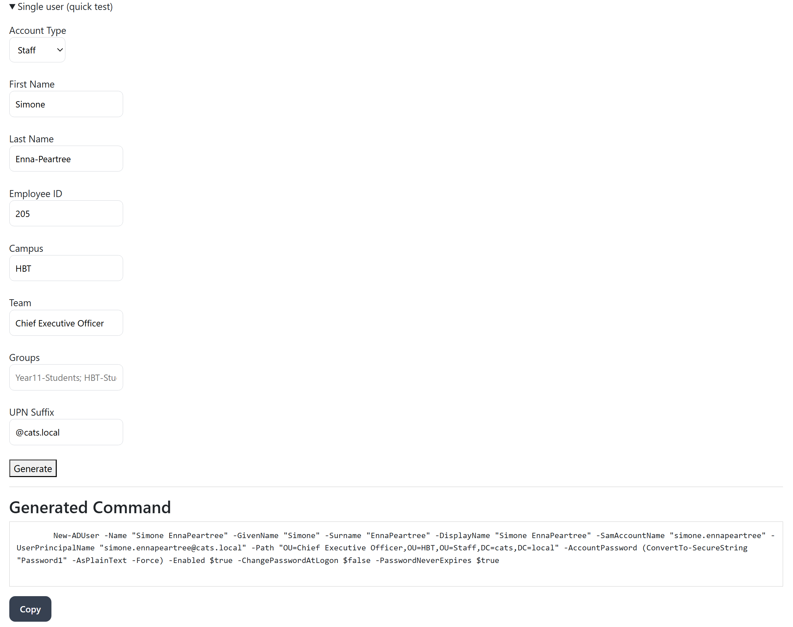
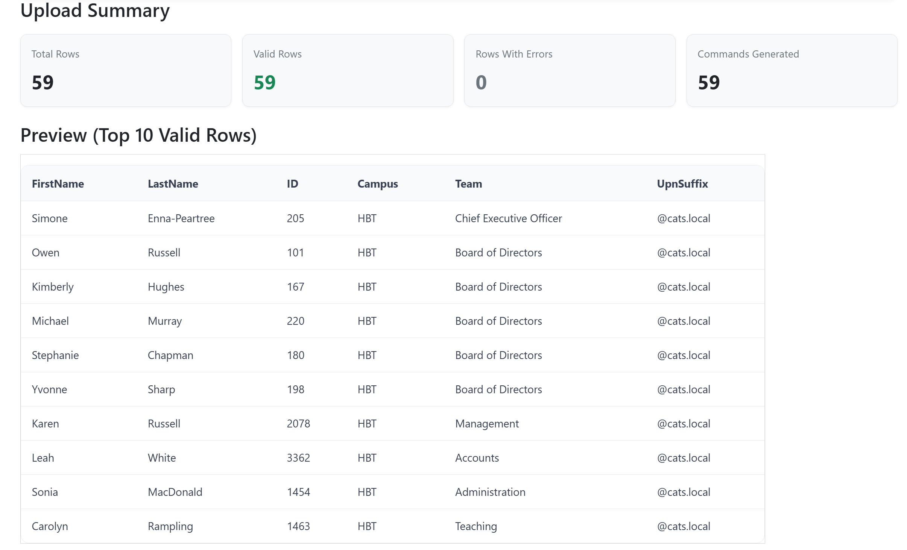
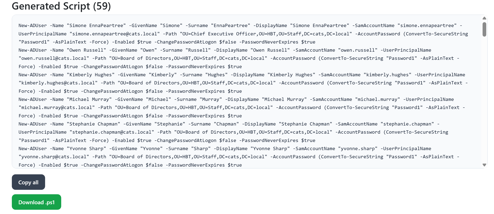
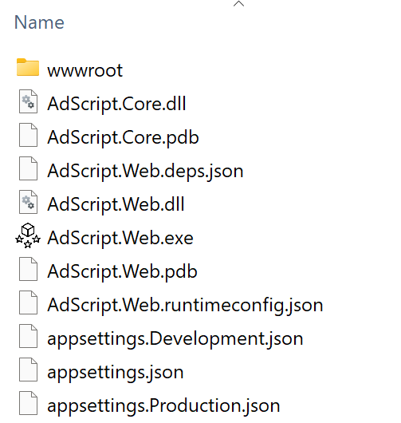

# AD Script Generator

Generate standardized Active Directory PowerShell scripts from Excel user lists through a local ASP.NET Core Web application.


---

## ✨ Features

- Bulk Excel upload for AD user provisioning
- Drag-and-drop Excel support
- Multi-worksheet Excel support
- Automated PowerShell `New-ADUser` generation
- Optional AD group membership generation
- Validation and sanitisation pipeline
- Script preview and downloadable `.ps1` output
- Local self-hosted Web App deployment
- Single-user quick testing mode

---

## 📸 Screenshots

### Single User Quick Test



### Excel Validation Preview



### Generated PowerShell Script



### Local Executable Deployment



---

## 🚀 Download Release

Download the latest Windows release from:

[Download Latest Release](../../releases)

---

## 🎯 Project Purpose

Active Directory user provisioning often involves repetitive, error-prone manual script writing.  
This tool automates the transformation of structured staff data (Excel) into validated and standardized PowerShell scripts.

The focus of this project is not only functionality — but also clean architecture and extensibility.

---

## 🏗 Architecture Overview

The solution follows a layered design to ensure scalability and reusability:
```
AdScriptGenerator
│
├── AdScript.Core
│   ├── Models
│   ├── Services
│   ├── Validation
│
├── AdScript.Web
│   ├── Razor Pages
│
└── (Planned)
    └── AdScript.Blazor
```
---

## ▶ Running Locally

1. Download the latest release
2. Extract the ZIP file
3. Run `AdScript.Web.exe`

Current release target: Windows x64.

No .NET installation required.

The application will automatically open in your browser at:

```text
http://localhost:5050
```

---

## 🔐 Security Note

This tool generates PowerShell scripts only. It does not execute commands or directly connect to Active Directory. Generated scripts should be reviewed by an administrator before running in a production environment.

---

### 🔹 Core Layer
Responsible for all business logic:

- Excel parsing
- Data sanitisation
- Naming standard enforcement
- Validation rules
- PowerShell script generation

The Core layer has no dependency on ASP.NET, enabling reuse across:
- Web applications
- Desktop applications
- Future Blazor implementation

---

### 🔹 Web Layer
Handles:

- File upload
- Column mapping
- Script preview
- Script download

The Web layer acts purely as a UI wrapper over the Core logic.

---

## ⚙ Technology Stack

- .NET 8
- ASP.NET Core Razor Pages
- Clean architecture principles
- Excel processing (ClosedXML)
- PowerShell script generation

---

## 📐 Engineering Principles Applied

- Separation of Concerns
- Layered Architecture
- Reusable Core Logic
- Validation Before Execution
- Enterprise Naming Standards
- Future-proof design for UI refactor (Blazor)

---

## 📋 Naming Standard Implementation

### SamAccountName
- Lowercase
- Special characters removed
- Max 20 characters (legacy NetBIOS constraint)
- Deterministic generation

### UserPrincipalName
- Email-style format
- Based on sanitized username
- Configurable domain suffix

### OU Path
- Multi-level dynamic OU construction
- Based on structured organizational data

### Validation Rules
- Prevent conflicting password flags
- Input sanitation before script generation
- Defensive rule enforcement

---

## 👤 Author

Raymond Wang  
Master of Information Technology and Systems (MITS) Graduate  
Certificate IV in Information Technology  

Focus areas:
- C#
- ASP.NET Core
- IT Automation
- Infrastructure Tooling


